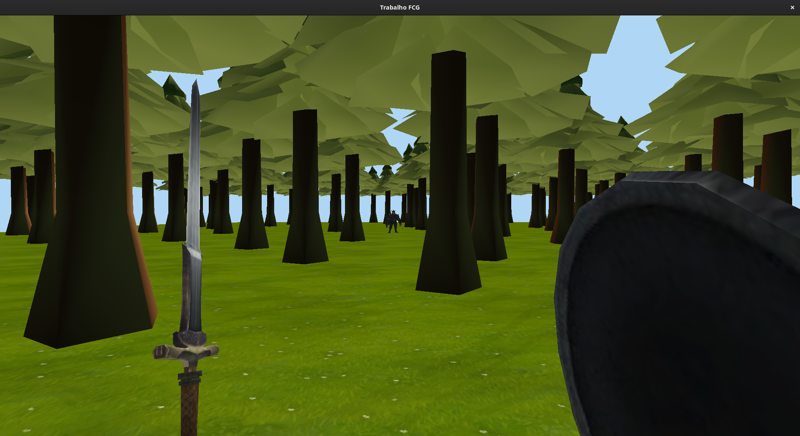
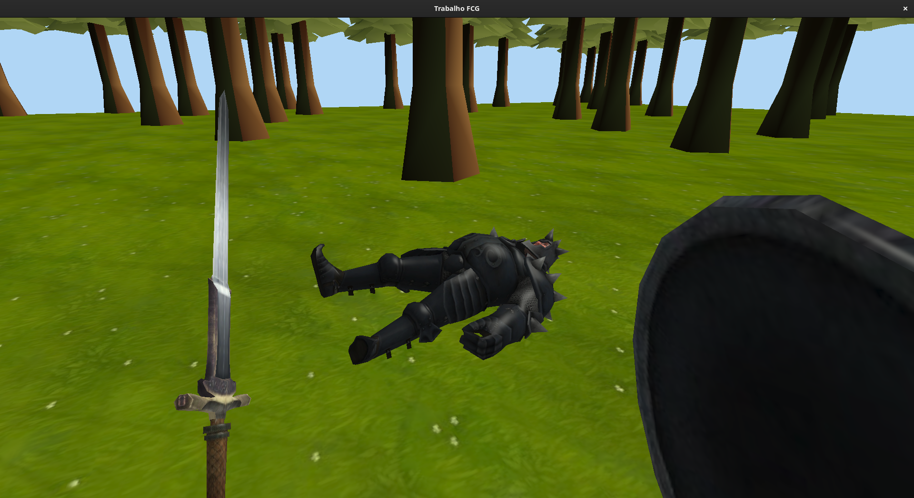

# Trabalho Final de FCG

Este trabalho é um jogo 3D *single-player* de duelo entre cavaleiros. Nele, o
jogador assume a perspectiva de um cavaleiro para lutar contra um oponente
virtual.

## Compilação

Os passos para compilar este trabalho são:

1. Clonar o repositório localmente
2. No diretório, executar `git submodule init` e `git submodule update` para
   clonar as versões mais recentes das dependências
3. Criar um novo diretório `build` e mover-se para ele
4. Executar o comando `cmake ..` para gerar os arquivos de build
5. Iniciar o build (com `make`, por exemplo)

## Como jogar

As teclas WASD movimentam o personagem. O mouse controla a câmera do personagem,
e o botão esquerdo serve para atacar. Além disso, o botão F5 alterna entre as
visões de primeira e terceira pessoas.

## Relatório

Segue o relatório deste trabalho.

### Malhas Poligonais Complexas

O modelo 3D de lutador utilizado configura um exemplo de malha poligonal
complexa.

### Transformações Geométricas e Controle de Câmeras Virtuais

As interações do usuário com o teclado e mouse permitem que o seu personagem se
mova pelo mapa e ataque o adversário. Para visualizar a ação de modos
diferentes, implementou-se uma câmera livre em primeira pessoa e uma câmera
look-at em terceira pessoa, alternáveis pelo botão F5.

### Instâncias de Objetos

O modelo do lutador foi instanciado duas vezes. Uma para representar o jogador,
e outra para o adversário. As árvores também são um único modelo repetido várias
vezes ao longo do mapa.

### Testes de Intersecção

Um teste de intersecção AABB-plano foi empregado para detectar e tratar a
colisão do adversário com o chão, o qual nasce no céu e cai até atingir o solo.

O teste raio-AABB foi utilizado para detectar se o ataque do jogador atingiu o
adversário. O raio partia do ponto *c* do centro da câmera e era dirigido no
sentido do vetor *view* até certa distância.

### Modelos de iluminação

A respeito dos modelos de iluminação, o chão e as árvores utilizaram o modelo
difuso, e os lutadores receberam o de Blinn-Phong. Sobre os modelos de
interpolação, o chão e os lutadores utilizaram o de Phong, enquanto que as
árvores foram interpoladas pelo de Gouraud.

### Mapeamento de texturas

Todos os objetos fizeram uso de texturas. Mesmo as árvores, apesar de não
parecer, por conta do modelo de interpolação de Gouraud.

O chão foi o único modelo cuja textura precisou ser repetida. Para tanto,
utilizou-se o modo de repetição `GL_REPEAT`.

### Movimentação com Curvas de Bézier

A movimentação com curva de Bézier foi aplicada na animação de ataque do
jogador. Em vez de a espada do jogador se mover linearmente da posição inicial
para a final durante a animação, utilizou-se uma trajetória levemente curva para
deixar o movimento mais natural.

### Animações Baseadas no Tempo

Todos os movimentos na aplicação foram calculados com base em intervalos de
tempo calculados através da diferença de *timestamp* da atualização atual para a
última. Exemplos incluem a movimentação do jogador, a queda do adversário e a
animação de ataque.

### Funcionalidade Extra: Geração Procedural de Paisagem

As árvores que compuseram a paisagem foram distribuídas pelo mapa de forma
procedural, através do algoritmo *Fast Poisson Disk Sampling*, cujo artigo pode
ser encontrado em:

<https://www.cs.ubc.ca/~rbridson/docs/bridson-siggraph07-poissondisk.pdf>

### Contribuições dos Membros de Grupo

Devido ao cancelamento da disciplina pelo antigo membro pouco antes do prazo de
entrega do trabalho, a distribuição de tarefas ficou bastante desbalanceada. O
novo membro, João Pedro, contribuiu principalmente para as tarefas de detecção
de intersecção ao final do trabalho, enquanto que o membro Felipe realizou as
demais tarefas.

### Uso de ChatGPT

O grupo fez uso do ChatGPT principalmente para solucionar dúvidas sobre o C++, e
ocasionalmente para questões sobre computação gráfica, como os algoritmos de
detecção de colisões. A dupla achou a ferramenta bastante útil para ajudar a
compreender conceitos não tão bem documentados que constavam fora dos *slides* da
disciplina.

## Imagens

Após o jogador se afastar o suficiente do centro do mapa o adversário deve nascer.

Depois de o jogador derrotar o adversário, ele deve cair morto no chão.

